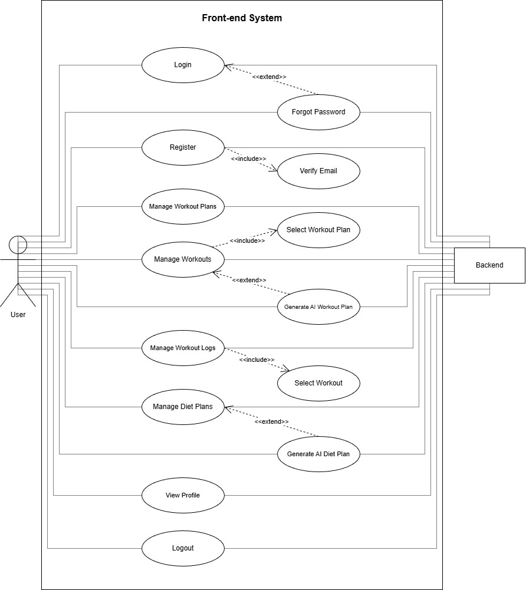
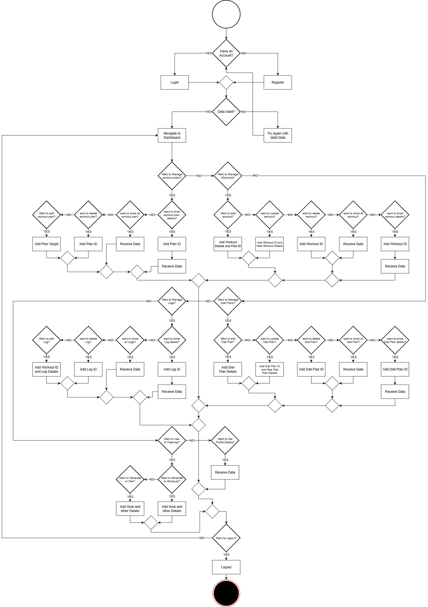
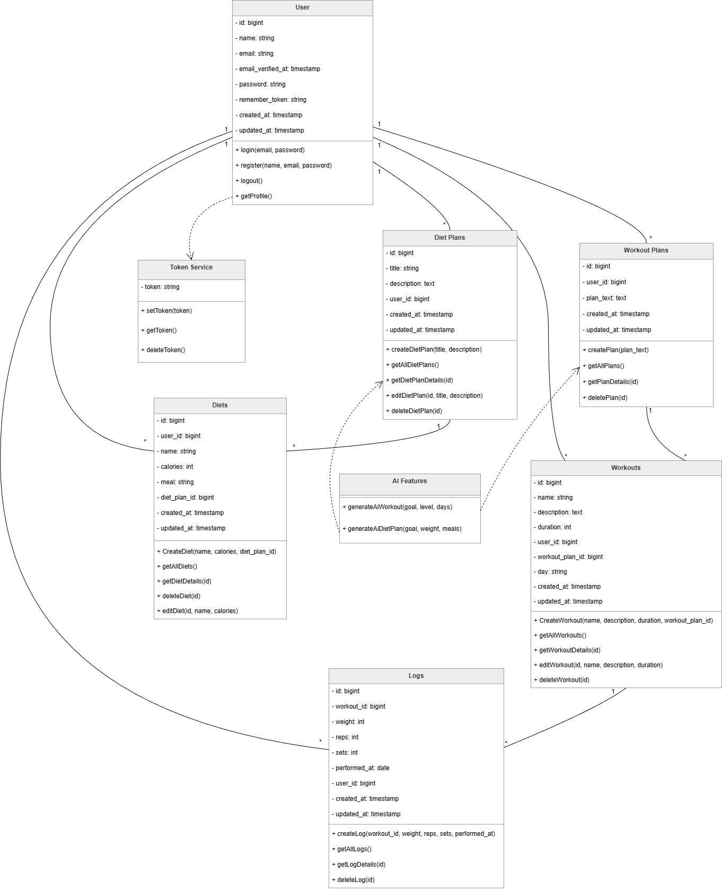

# Gym Frontend (React)

- This project was developed as part of a System Design and Analysis course.

- Read API Documentation: [API Documentation](Docs/API_Documentation.md)

---

  ### Use Case Diagram

  

  - See the full use case diagram: [PDF](Docs/Front-end-use-Diagram.pdf)

---

  ### Activity Diagram

  

  - See the full activity diagram: [PDF](Docs/Activity-Diagram.pdf)

---

  ### Class Diagram

  

  - See the full class diagram: [PDF](Docs/front-end_Class-Diagram.pdf)

---

## Instructions

### Prerequisites
- Node.js (version 18 or higher)
- npm or yarn

### Installation

1. Clone the repository:
   ```
   git clone https://github.com/Siry001/project_frontend.git
   ```

2. Navigate to the project directory:
   ```
   cd project_frontend
   ```

3. Install dependencies:
   ```
   npm install
   ```

### Running the Application

To start the development server:
```
npm run dev
```

The application will be available at `http://localhost:5173` (default Vite port).

### Building for Production

To build the application:
```
npm run build
```

To preview the production build:
```
npm run preview
```

